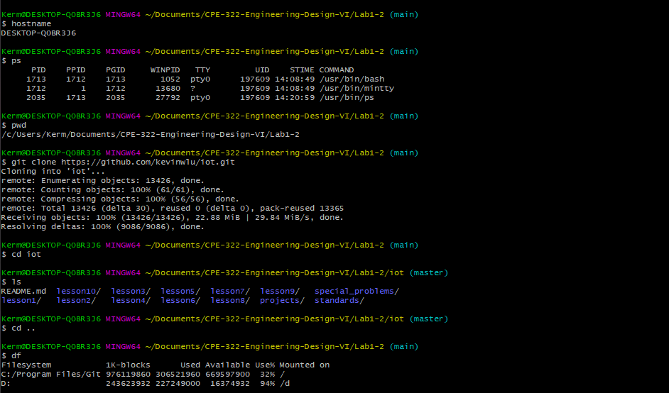
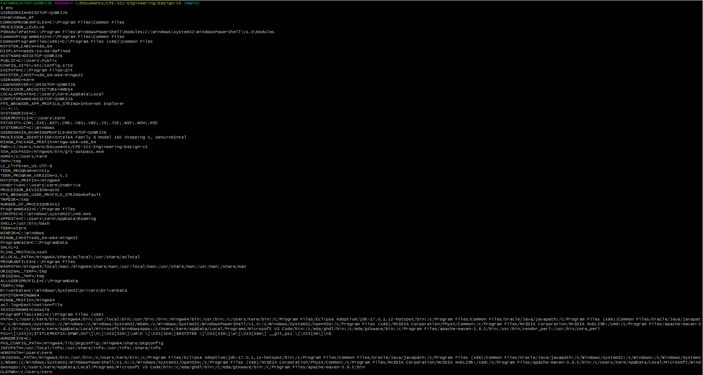
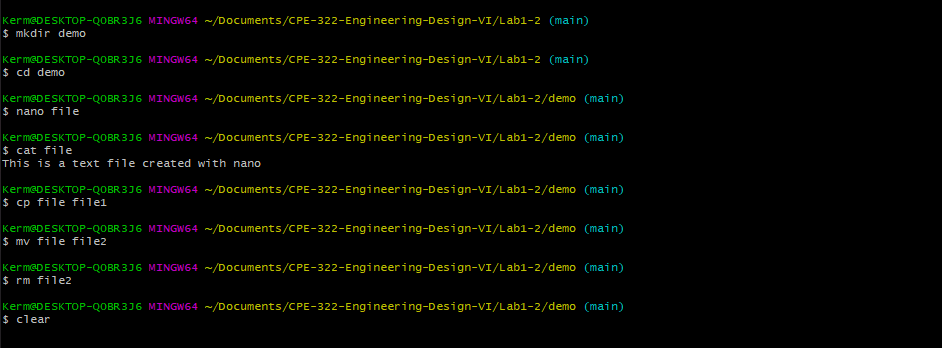
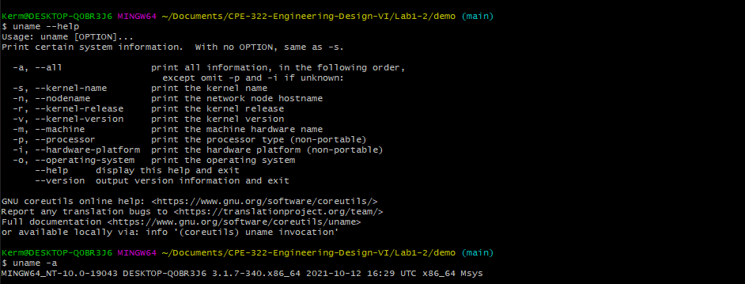
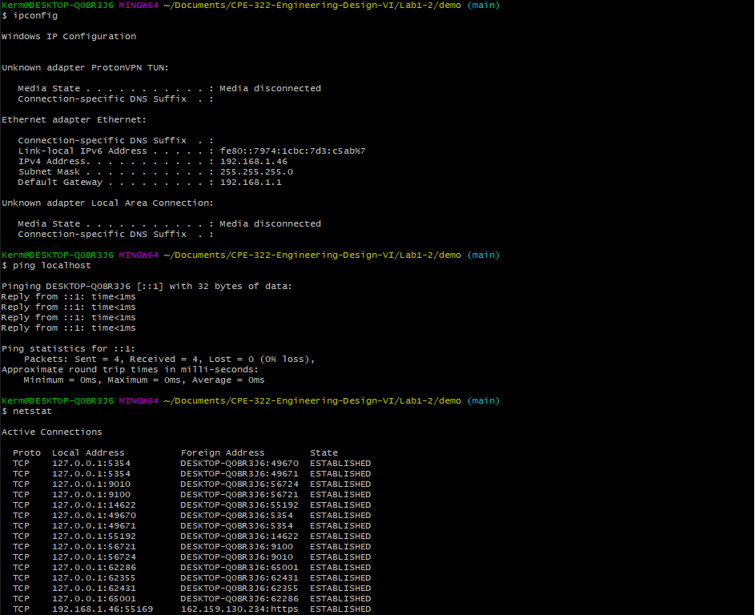

# Labs 1 and 2 - Command Line

This lab focused on learning linux-based terminal commands. Below many commonly used commands can be found being demostrated.

## Basic Commands

## env Command

## File and Directory Manipulation Commands

## GNU nano text editor

## uname Commands

## Network Commands

