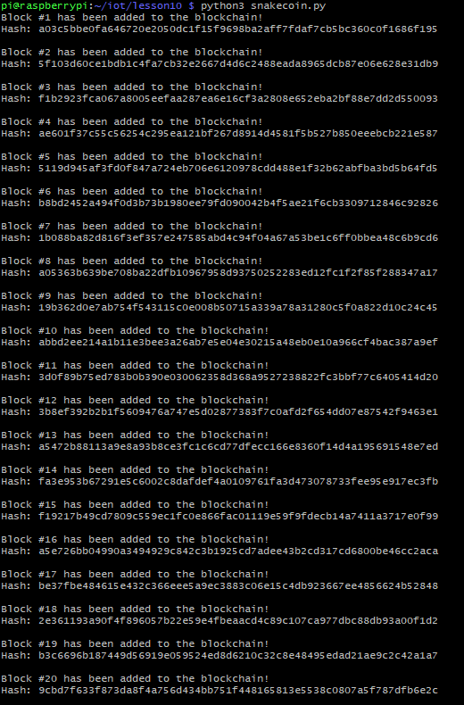
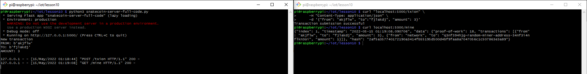
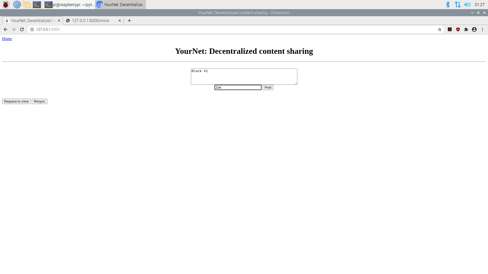
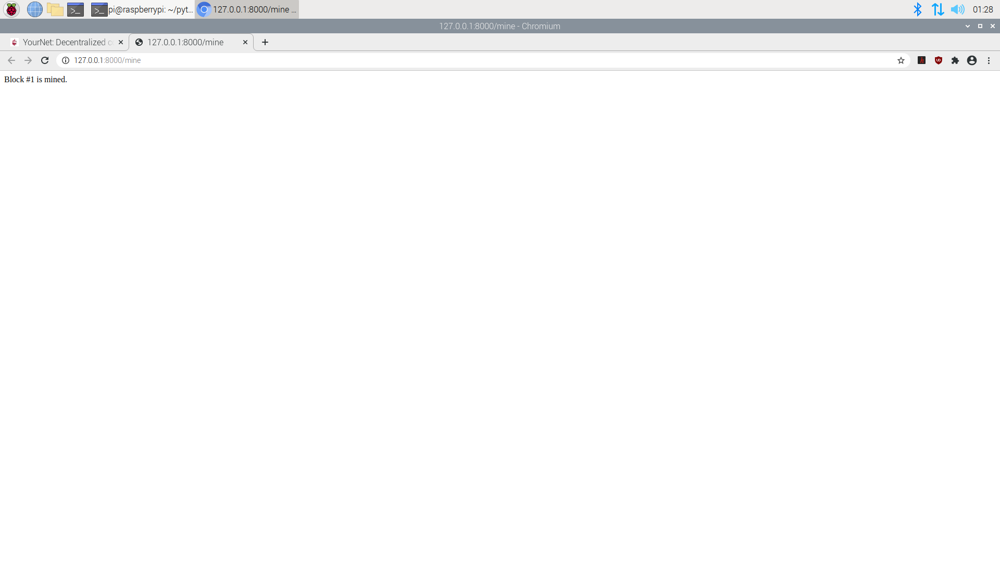
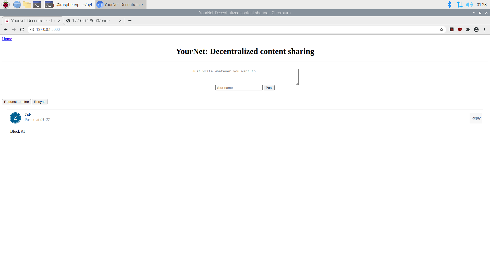

# Lab 10 - Blockchain

This lab focused on demonstrating blockchain possibilites in python as well as PyOTA

## Comparing the hash value function ran two times

## 20 snakecoin blocks added to blockchain

## Mining a snakecoin block

## Creating a block on the Python blockchain app

## Mining the block that was created on the blockchain app

## Resyncing the blockchain to display the newly mined block

