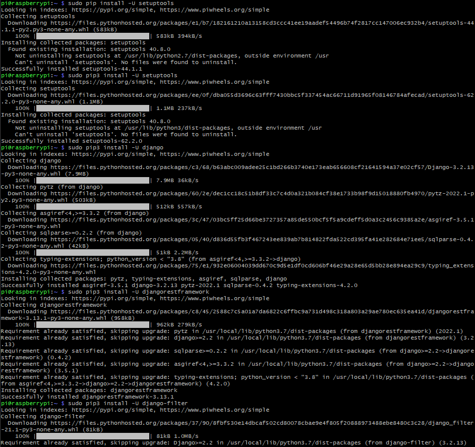
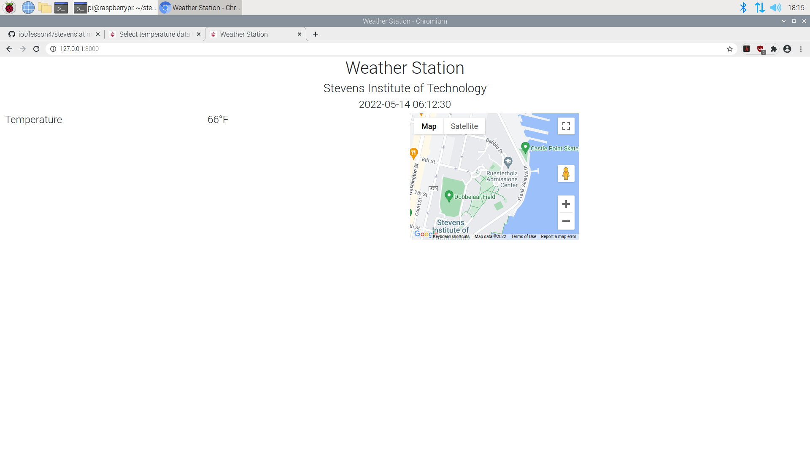
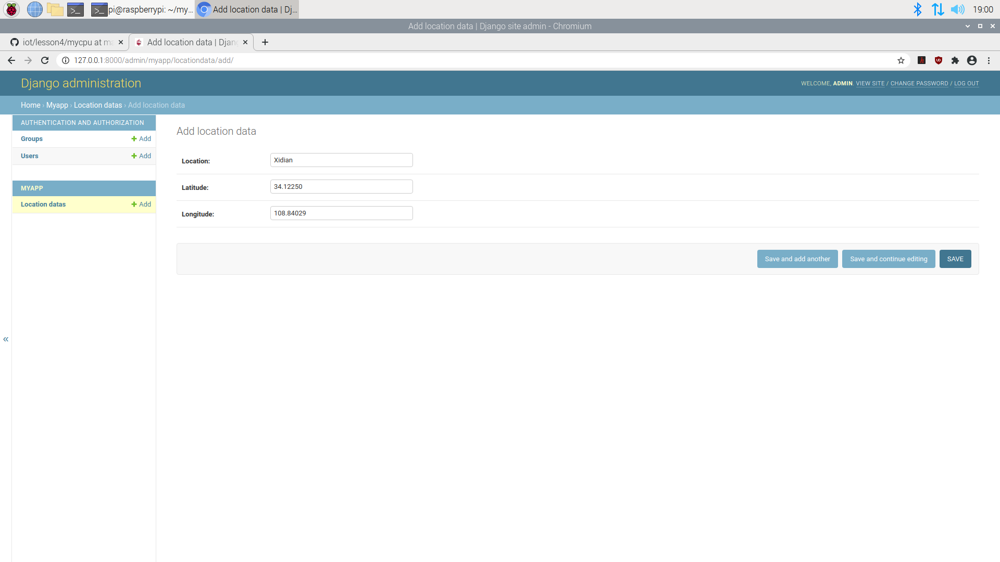

# Labs 4 - Django and Flask

This lab focused on learning how to creating servers utilizing mysql, Django, and Flask.

## stevens project

### Installing all necessary packages

### Setting up MariaDB

### MariaDB montior

### Inputting temperature data for "stevens" project

### Viewing weather station on pi

### Viewing weather station on Windows 10 desktop

## mycpu project

### Inputting location data

### Viewing mycpu server collecting data using controller.py

## Hello World running on Flask

