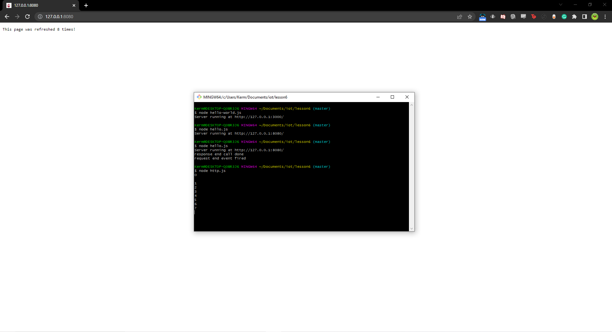

# Lab 6 - Node.js and Pystache

This lab focused on using Node.js to create local servers and Pystache

## Hello World local server

## Hello World ran with hello.js

## Local server that tracks number of times page has been refreshed

## Pystache to create a template system for saying hello

