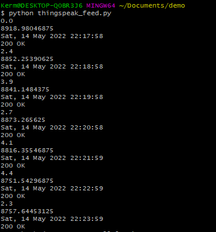
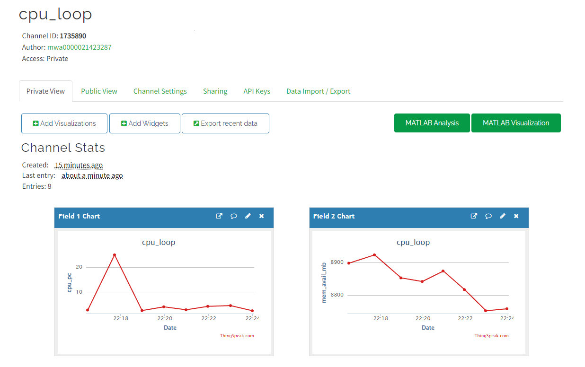
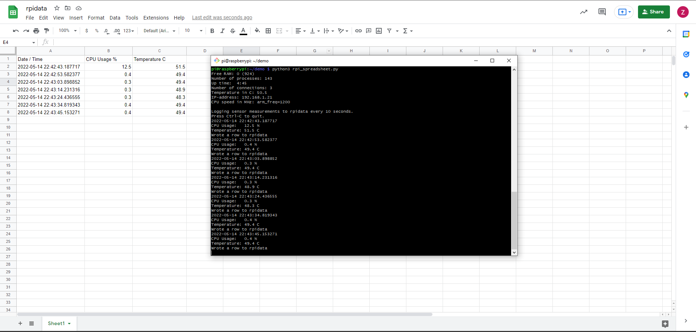

# Lab 7 - ThingSpeak and Google Sheets

This lab focused on ustilizing ThingSpeak and Google APIs to write system data to both sites

## ThingSpeak data getting written from terminal

## Two graphs plotting the written data displayed on ThingSpeak.com

## Raspberry Pi writing system information to Google Sheets using a service account JSON key

